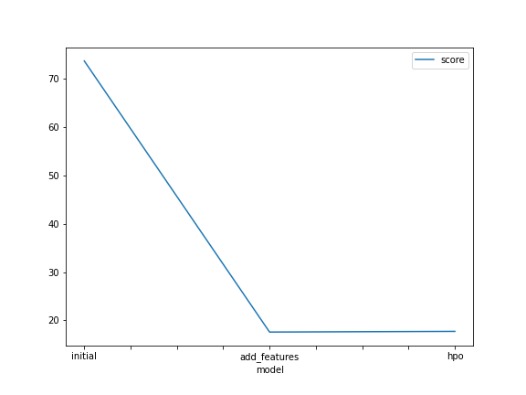
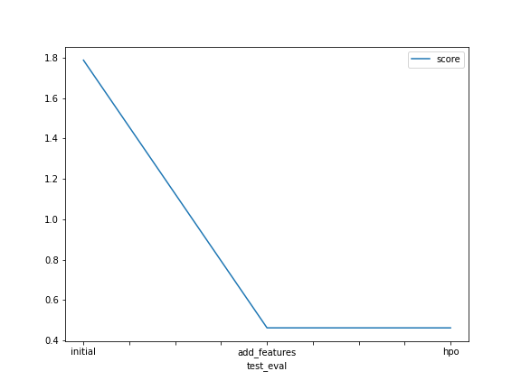

# Report: Predict Bike Sharing Demand with AutoGluon Solution
#### Reza Dwi Utomo

## Initial Training
### What did you realize when you tried to submit your predictions? What changes were needed to the output of the predictor to submit your results?
The results must comply with the format provided by the competition organizer, i.e. ['sample_submission.csv'](./sample_submission.csv), in which the predictions are sorted ascendingly. Moreover, it is not allowed to have any value below zero so that you could substitute such a negative value with zero.

### What was the top ranked model that performed?
Weighted Ensemble L3 is the best model so far, in default, new features, and HPO strategy.

## Exploratory data analysis and feature creation
### What did the exploratory analysis find and how did you add additional features?

First of all, I plotted all necessary features. And I've found that numerical features, i.e. `temp`, `atemp`, and `humidity` temp to resemble normal distribution, whereas the `windspeed` is slightly left skewed. Therefore, I left those features as they are (actually, for future improvement, you could analyze the `windspeed` column more deeply).

I focused more on the categorical features, i.e. `holiday`, `workingday`, `season`, and `weather`. The first two already have binary values. They are nice. Meanwhile, the last two have a few different values, instead of having only two values. To cope with this issue, we could implement one-hot encoding to the two features.

Lastly, for the `datetime` column, it is much better to split it into more atomic value, i.e. year, month, day, and hour.

### How much better did your model preform after adding additional features and why do you think that is?

It improved significantly. In model evaluation and Kaggle result, the error metric gets 4 times smaller. The reasons behind this major improvement are as follows:

- If both `season` and `weather` features were used in their raw form, the model recognizes them as numerical features, and we don't want this. Subsequently, by applying one-hot encoding to each, we make sure the model learns them as categorical ones.

- The `datetime` feature consists much information. By splitting it up, we could collect year, month, day, and hour. Each has its unique behavior. We want the model to recognize and differentiate these patterns.

## Hyper parameter tuning
### How much better did your model preform after trying different hyper parameters?
Just a little. Almost nothing changed. In Kaggle result, the model just improved in extremely small value, i.e. `0.0001`. In the meantime, in model evaluation, the model performance even becomes worse by `0.14`.

### If you were given more time with this dataset, where do you think you would spend more time?
Engineering your dataset is much worth your time and effort rather than doing hyperparameter optimization.

### Create a table with the models you ran, the hyperparameters modified, and the kaggle score.
|model|time_limit|presets|num_bag_folds|num_bag_sets|num_stack_levels|auto_stack|num_trials|scheduler|searcher|score|
|--|--|--|--|--|--|--|--|--|--|--|
|initial|600|best_quality|default|default|default|default|default|default|default|1.78786|
|add_features|600|best_quality|default|default|default|default|default|default|default|0.46177|
|hpo|1200|best_quality|5|2|2|True|5|local|auto|0.46167|

### Create a line plot showing the top model score for the three (or more) training runs during the project.

### Create a line plot showing the top kaggle score for the three (or more) prediction submissions during the project.

## Summary
This first project of [Udacity's AWS Machine Learning Engineer](https://www.udacity.com/course/aws-machine-learning-engineer-nanodegree--nd189), aiming to solve [bike-sharing-demand competition](https://www.kaggle.com/competitions/bike-sharing-demand), has been carried out. The [AutoGluon](https://auto.gluon.ai/) AutoML is used to develop base models. As the provided dataset has been clean, it is unnecessary to perform data cleansing. Instead, adjusting column data types is the one implemented.

Afterward, the AutoGluon `TabelPredictor` is utilized to search the best model. The metric score, [RMSE](https://c3.ai/glossary/data-science/root-mean-square-error-rmse/#:~:text=To%20compute%20RMSE%2C%20calculate%20the,square%20root%20of%20that%20mean.), shows values `73.76` in model evaluation and `1.79` in Kaggle result.

To increase the performance, some feature engineerings are implemented. The metric score improves significantly to `17.58` in model evaluation and `0.46177` in Kaggle result.

The last strategy is to optimize model hyperparameters. And the metric score almost does not change, i.e. `17.72` in model evaluation and `0.46167` in Kaggle result.

The strategy by implementing feature engineering gives more promising results than that of HPO. This phenomenon really proves the benefit by implementing so-called [**data-centric AI**](https://datacentricai.org/). You could engineer your model, doing hyperparameter optimization, changing the model algorithm, using the most sophisticated algorithm or model architecture, etc. But, in the end, the result from any model-centric approach could not beat that of the data-centric approach.
